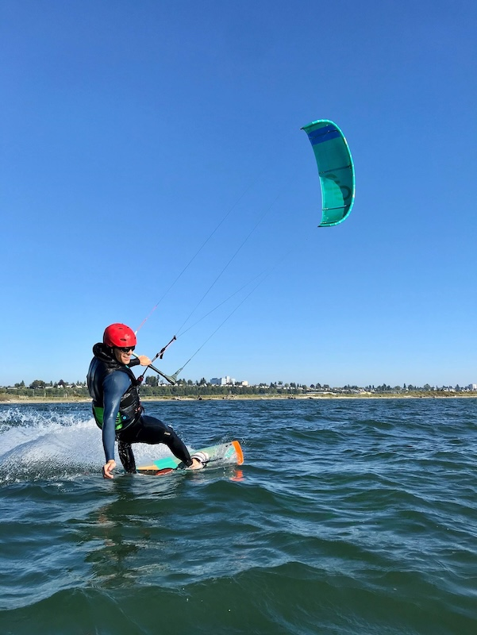

## Welcome 
This is the web page of Hans Olav Norheim. I'm a software engineer specializing in database systems. I'm currently a Tech Lead in Lakebase at Databricks. Before that, I was at Microsoft's database systems group, where I worked on various parts of the SQL Server database engine and Azure SQL Database in various capacities as Tech Lead, Engineering Manager and Group Engineering Manager.

I'm originally from Norway, but currently reside in Athens, GA, USA where [my wife](https://www.jaclynsaunders.com/) is a professor at the University of Georgia.

You can reach me at hansonorheim *at * gmail.com.

### Resources
At some point I might add more content here, but for now, here are some relevant links:

* [My LinkedIn profile](https://www.linkedin.com/in/hans-olav-norheim-a3810b9/)
* [A blog post I wrote on hot patching SQL Server in production](https://techcommunity.microsoft.com/t5/azure-sql-blog/hot-patching-sql-server-engine-in-azure-sql-database/ba-p/849700)
* [A blog post I wrote on Zero Downtime Patching in Lakebase](https://www.databricks.com/blog/zero-downtime-patching-lakebase-part-1-prewarming)
* [My master's thesis on Query Optimization](./blog/content/binary/MasterReport.pdf) from 2009.
* [A paper](./blog/content/binary/howflashmemory.pdf) on how flash memory impacts RDBMSs I wrote for a school assignment in 2008 when SSDs were all the new rave (that has oddly enough gotten cited a few times).
* [Graph algorithms in T-SQL I had fun writing](./sql/graphs.html)

### Spare Time

In my spare time, I dabble a bit in 3D printing, microcontrollers and home automation. I hope to share more of my projects, but for now this is it:

* [Low-energy Nextion LCD Display](https://github.com/hans-olav/dbus-nextion) for the Victron Energy ecosystem.

I also enjoy kitesurfing when I get the chance. Here's a picture:

{: style="text-align: center;"}
